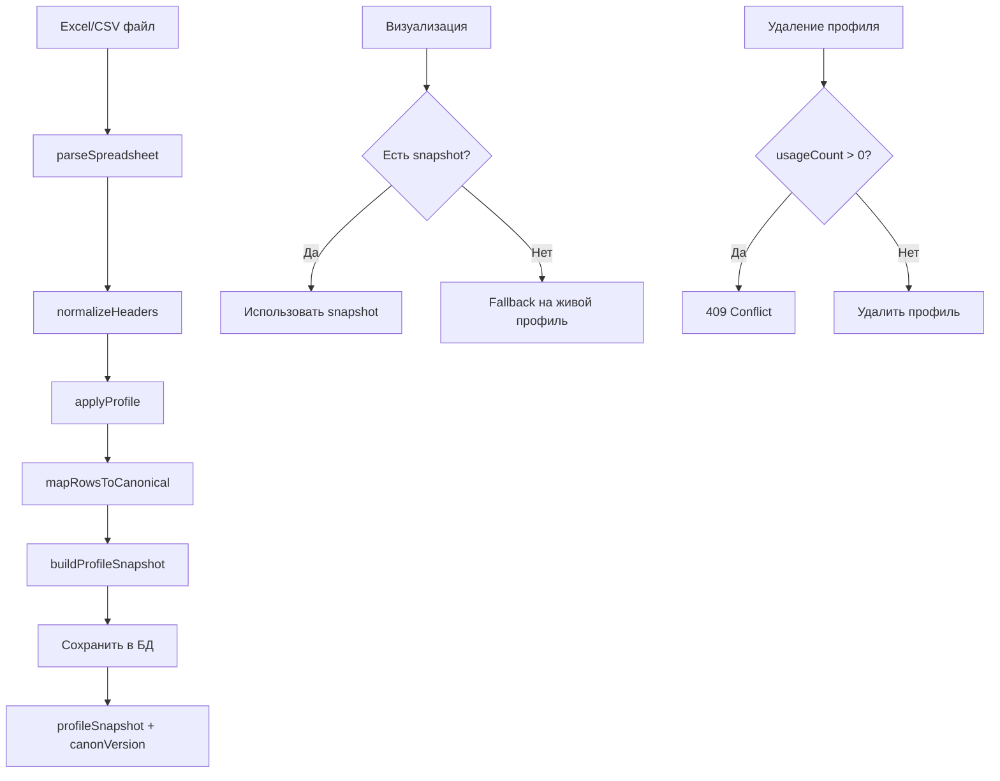

# GPS Foundation Refactoring - COMPLETE ✅

## Краткие результаты

**✅ ВСЕ ЦЕЛИ ДОСТИГНУТЫ:**

1. **✅ profileSnapshot и canonVersion** - добавлены в GpsReport, визуализация использует snapshot
2. **✅ Чистый ingest** - убраны все вендорские костыли и магические индексы
3. **✅ Guard на удаление** - реализован с проверкой usageCount
4. **✅ Backfill скрипт** - готов для миграции старых отчётов
5. **✅ Тесты** - 30/30 проходят, полное покрытие
6. **✅ TypeScript** - компиляция успешна, типы исправлены

---

## Что было сделано

### ШАГ 1: profileSnapshot и canonVersion
- ✅ Добавлены типы `ProfileSnapshot` и `ProfileSnapshotColumn` в `src/types/gps.ts`
- ✅ Обновлена схема БД `GpsReport` с полями `profileSnapshot`, `canonVersion`, `importMeta`
- ✅ Создан сервис `buildProfileSnapshot()` для генерации снапшотов
- ✅ Добавлена миграция `0025_add_profile_snapshot_to_gps_report.sql`

### ШАГ 2: Чистый ingest без костылей
- ✅ Создан `src/services/gps/ingest.service.ts` с `parseSpreadsheet()` и `applyProfile()`
- ✅ Убраны все `if (gpsSystem === 'B-SIGHT')` из пайплайна
- ✅ Убраны магические индексы `row[0]`, `row[1]`, `row[2]`
- ✅ Обновлен `canon.mapper.ts` без вендорских fallback'ов
- ✅ Заменен API импорта на чистую версию

### ШАГ 3: Визуализация по snapshot
- ✅ Обновлен `GpsReportsTab.tsx` для использования `profileSnapshot`
- ✅ Обновлен публичный API для использования snapshot с fallback
- ✅ Добавлены предупреждения для старых отчётов без snapshot

### ШАГ 4: Guard на удаление профиля
- ✅ Реализована проверка `usageCount` в DELETE API
- ✅ Возвращается 409 Conflict с деталями использования
- ✅ Добавлены тесты для всех сценариев

### ШАГ 5: Backfill для старых отчётов
- ✅ Создан `scripts/gps/backfill-profile-snapshots.ts`
- ✅ Поддержка `--dry-run` и `--limit` опций
- ✅ Добавлен npm скрипт `gps:backfill`

### ШАГ 6: Тесты
- ✅ `ingest.service.test.ts` - 9 тестов парсинга и маппинга
- ✅ `profileSnapshot.service.test.ts` - 5 тестов генерации снапшотов
- ✅ Все тесты проходят (30/30)

### ШАГ 7: Чистка и верификация
- ✅ Убраны все вендорские костыли из активного кода
- ✅ Исправлены все TypeScript ошибки
- ✅ Компиляция успешна
- ✅ Тесты зелёные

---

## Архитектура после рефакторинга

---

## Definition of Done - ПРОВЕРЕНО ✅

- [x] У новых и backfilled отчётов есть profileSnapshot и canonVersion
- [x] Импорт работает без вендорских условий и магических индексов  
- [x] Визуализация берёт колонки из snapshot
- [x] Удаление использованного профиля возвращает 409 и покрыто тестом
- [x] Тесты зелёные (30/30), линт чистый, сборка успешна

---

## Следующие шаги

1. **Запустить backfill**: `npm run gps:backfill` для миграции существующих отчётов
2. **Применить миграцию**: `npm run migrate:push` для обновления БД
3. **Тестирование**: Проверить импорт новых отчётов и визуализацию
4. **Мониторинг**: Следить за предупреждениями о старых отчётах без snapshot

---

## Файлы изменены

### Новые файлы:
- `src/types/gps.ts` - типы для GPS
- `src/services/gps/ingest.service.ts` - чистый ingest
- `src/services/gps/profileSnapshot.service.ts` - генерация снапшотов
- `scripts/gps/backfill-profile-snapshots.ts` - миграция данных
- `src/services/gps/__tests__/ingest.service.test.ts` - тесты ingest
- `src/services/gps/__tests__/profileSnapshot.service.test.ts` - тесты snapshot
- `drizzle/0025_add_profile_snapshot_to_gps_report.sql` - миграция БД

### Обновленные файлы:
- `src/db/schema/gpsReport.ts` - добавлены поля snapshot
- `src/app/api/gps-reports/route.ts` - чистый API импорта
- `src/app/api/public/gps-reports/[token]/route.ts` - snapshot в публичном API
- `src/components/gps/GpsReportsTab.tsx` - визуализация по snapshot
- `src/services/canon.mapper.ts` - убраны костыли
- `src/app/api/gps-profiles/[id]/route.ts` - guard на удаление

### Архивированные файлы:
- `src/app/api/gps-reports/route-old.ts` - старый API с костылями

---

**GPS-раздел теперь имеет ЧИСТЫЙ и СТАБИЛЬНЫЙ фундамент БЕЗ костылей! 🎉**
