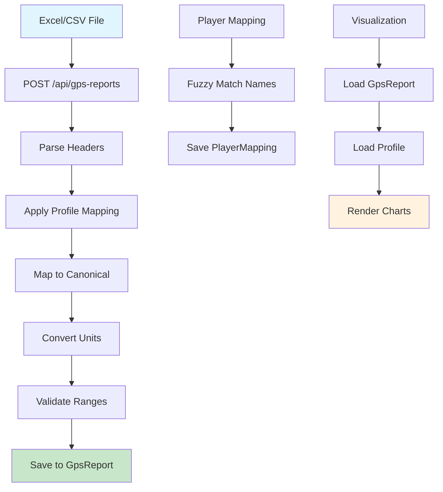
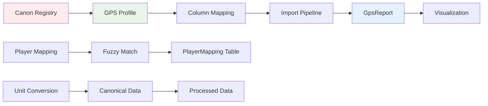

# GPS Inventory Report

## Краткие выводы

**❌ КРИТИЧЕСКИЕ ПРОБЛЕМЫ:**
1. **НЕТ profileSnapshot** - визуализация использует "живой" профиль, а не snapshot на момент импорта
2. **МНОГО ВЕНДОРСКИХ КОСТЫЛЕЙ** - жёсткие if/switch по GPS системам в пайплайне
3. **НЕТ GUARD на удаление профиля** - TODO в коде, но не реализован
4. **МАГИЧЕСКИЕ ИНДЕКСЫ** - жёсткие номера колонок [0], [1], [2] в коде

**✅ ЧТО РАБОТАЕТ:**
1. **Канонический слой** - полный, версионированный, SI-единицы
2. **Валидация профилей** - уникальность canonicalKey, Zod схемы
3. **Маппинг игроков** - fuzzy matching, переиспользование маппингов
4. **Пересчёт данных** - есть механизм recalculate

---

## A) Канонический слой (метрики/единицы)

### Таблица канонических метрик

| canonicalCode | displayName | dimension | unit (SI) | agg | plausibleMin/Max | version |
|---------------|-------------|-----------|-----------|-----|------------------|---------|
| athlete_name | Имя игрока | identity | string | none | - | 1.0.1 |
| position | Позиция | identity | string | none | - | 1.0.1 |
| total_distance_m | Общая дистанция | distance | m | sum | 0-25000 | 1.0.1 |
| duration_s | Время на поле (сек) | time | s | sum | 0-7200 | 1.0.1 |
| minutes_played | Время на поле (мин) | time | min | sum | 0-120 | 1.0.1 |
| distance_zone1_m | Дистанция зона 1 | distance | m | sum | 0-20000 | 1.0.1 |
| ... | ... | ... | ... | ... | ... | ... |
| max_speed_ms | Максимальная скорость | speed | m/s | max | 0-14 | 1.0.1 |
| avg_heart_rate_bpm | Средний пульс | heart_rate | bpm | avg | 40-210 | 1.0.1 |
| player_load_au | Игровая нагрузка | load | AU | sum | 0-1000 | 1.0.1 |

**Всего метрик:** 50+ (полный список в `src/canon/metrics.registry.json`)

### Конвертация единиц

**Файл:** `src/canon/units.ts`
- ✅ Все единицы в SI (м, с, м/с, м/с², bpm, count, AU, W/kg, ratio)
- ✅ Конвертация через `convertUnit()`, `toCanonical()`, `fromCanonical()`
- ✅ Поддержка: км→м, км/ч→м/с, мин→с, %→ratio, g→м/с²
- ✅ Тесты: `src/canon/__tests__/units.test.ts`

### Версионирование

**Файл:** `src/canon/metrics.registry.json`
- ✅ Версия: 1.0.1
- ✅ Дата генерации: 2025-09-05
- ✅ Метаданные: `__meta` объект

---

## B) Модель GPS-профиля

### Схема профиля

**Файл:** `src/db/schema/gpsProfile.ts`
```typescript
{
  id: uuid,
  name: string,
  gpsSystem: string, // B-SIGHT, Polar, etc.
  columnMapping: jsonb, // Маппинг колонок
  visualizationConfig: jsonb,
  metricsConfig: jsonb,
  customFormulas: jsonb,
  dataFilters: jsonb,
  // ... timestamps, clubId, createdById
}
```

### Валидация

**Файл:** `src/validators/gpsProfile.schema.ts`
- ✅ Zod схемы для создания/обновления
- ✅ Проверка уникальности `canonicalKey` внутри профиля
- ✅ Валидация против канонического реестра
- ✅ Запрет дублирования названий профилей

### Контракт columnMapping

```typescript
{
  type: 'column' | 'formula',
  name: string,
  mappedColumn: string,
  canonicalKey: string,
  isVisible: boolean,
  order: number,
  formula?: string
}
```

---

## C) Пайплайн импорта/обработки

### Основные файлы

| Файл | Что внутри | Зачем | Риски/замечания |
|------|------------|-------|-----------------|
| `src/app/api/gps-reports/route.ts` | POST импорт файлов | Загрузка Excel/CSV | ❌ Много вендорских костылей |
| `src/services/canon.mapper.ts` | Маппинг в канон | Конвертация данных | ❌ Жёсткие индексы колонок |
| `src/services/gps.service.ts` | Обработка данных | Бизнес-логика | ❌ B-SIGHT специфика |
| `src/app/api/gps-reports/recalculate/route.ts` | Пересчёт | Обновление данных | ✅ Хорошо реализован |

### ❌ RED FLAGS - Вендорские костыли

| Файл:строка | Что происходит | Почему костыль |
|-------------|----------------|----------------|
| `src/app/api/gps-reports/route.ts:507` | `if (gpsSystem === 'B-SIGHT')` | Жёсткая привязка к вендору |
| `src/app/api/gps-reports/route.ts:718-737` | `if (columnName === 'Player' && row[0])` | Магические индексы колонок |
| `src/services/canon.mapper.ts:205` | `// Для B-SIGHT данных: не конвертируем` | Вендорская логика в каноне |
| `src/services/canon.mapper.ts:295-301` | `row['TD'] ?? row['Time'] ??` | Жёсткие названия полей |
| `src/app/api/gps-profiles/templates/route.ts:12` | `'B-SIGHT': { ... }` | Шаблоны по вендорам |

### Пайплайн обработки

1. **Ingest** → `src/app/api/gps-reports/route.ts:POST`
2. **Parse** → XLSX.read() + headers extraction
3. **Normalize** → `normalizeHeaders()` + `processData()`
4. **Apply Profile** → `mapRowsToCanonical()`
5. **Canonize** → `src/services/canon.mapper.ts`
6. **Persist** → `db.insert(gpsReport)`

---

## D) Маппинг игроков

### Сервис

**Файл:** `src/services/playerMapping.service.ts`
- ✅ Приоритет: stable athlete_id > имя
- ✅ Fuzzy matching с Левенштейном
- ✅ Переиспользование маппингов
- ✅ Сохранение confidence score

### Логика приоритета

1. **Существующий маппинг** → `findExistingMapping()`
2. **Fuzzy поиск** → `fuzzyMatch()` по имени
3. **Создание нового** → `saveMapping()`

### Хранение маппингов

**Таблица:** `PlayerMapping`
- `reportName` - имя из файла
- `playerId` - ID игрока в системе
- `confidenceScore` - уверенность (0-1)
- `mappingType` - exact/fuzzy/manual/alias

---

## E) Визуализация отчётов

### ❌ КРИТИЧЕСКАЯ ПРОБЛЕМА: НЕТ profileSnapshot

**Проблема:** Визуализация использует "живой" профиль, а не snapshot на момент импорта.

**Файлы:**
- `src/components/gps/GpsReportsTab.tsx:119` - загружает профиль по `report.profileId`
- `src/app/public/gps-report/[token]/page.tsx` - тоже использует живой профиль

**Что должно быть:**
```typescript
// В GpsReport должно быть:
{
  profileSnapshot: {
    version: "1.0.1",
    columnMapping: [...],
    visualizationConfig: {...},
    metricsConfig: {...}
  }
}
```

---

## F) API эндпоинты GPS

### Карта API

| Метод | Путь | Назначение | Auth | Роль |
|-------|------|------------|------|------|
| GET | `/api/gps-profiles` | Список профилей | ✅ | gpsProfiles.read |
| POST | `/api/gps-profiles` | Создание профиля | ✅ | gpsProfiles.create |
| GET | `/api/gps-profiles/[id]` | Получение профиля | ✅ | gpsProfiles.read |
| PUT | `/api/gps-profiles/[id]` | Обновление профиля | ✅ | gpsProfiles.update |
| DELETE | `/api/gps-profiles/[id]` | Удаление профиля | ✅ | gpsProfiles.delete |
| GET | `/api/gps-profiles/[id]/usage` | Использование профиля | ✅ | gpsProfiles.read |
| GET | `/api/gps-proports` | Список отчётов | ✅ | gpsReports.read |
| POST | `/api/gps-reports` | Загрузка отчёта | ✅ | gpsReports.create |
| GET | `/api/gps-reports/[id]` | Получение отчёта | ✅ | gpsReports.read |
| POST | `/api/gps-reports/recalculate` | Пересчёт данных | ✅ | gpsReports.update |
| GET | `/api/player-mappings` | Маппинги игроков | ✅ | gpsReports.read |
| POST | `/api/player-mappings` | Создание маппинга | ✅ | gpsReports.create |
| POST | `/api/player-mappings/auto-match` | Автосопоставление | ✅ | gpsReports.create |

---

## G) База данных

### Схемы таблиц

#### GpsProfile
```sql
CREATE TABLE "GpsProfile" (
  "id" uuid PRIMARY KEY DEFAULT gen_random_uuid(),
  "name" varchar(255) NOT NULL,
  "gpsSystem" varchar(100) NOT NULL,
  "columnMapping" jsonb NOT NULL,
  "visualizationConfig" jsonb NOT NULL,
  "metricsConfig" jsonb NOT NULL,
  "customFormulas" jsonb,
  "dataFilters" jsonb,
  -- ... timestamps, clubId, createdById
);
```

#### GpsReport
```sql
CREATE TABLE "GpsReport" (
  "id" uuid PRIMARY KEY DEFAULT gen_random_uuid(),
  "name" varchar(255) NOT NULL,
  "fileName" varchar(255) NOT NULL,
  "gpsSystem" varchar(100) NOT NULL,
  "profileId" uuid NOT NULL,
  "rawData" jsonb,
  "processedData" jsonb,
  "metadata" jsonb,
  "isProcessed" boolean DEFAULT false,
  -- ... timestamps, clubId, uploadedById
);
```

#### PlayerMapping
```sql
CREATE TABLE "PlayerMapping" (
  "id" uuid PRIMARY KEY DEFAULT gen_random_uuid(),
  "reportName" varchar(255) NOT NULL,
  "gpsSystem" varchar(100) NOT NULL,
  "playerId" uuid NOT NULL,
  "teamId" uuid NOT NULL,
  "confidenceScore" real NOT NULL,
  "mappingType" varchar(50) NOT NULL,
  "isActive" boolean DEFAULT true,
  -- ... timestamps, clubId, createdById
);
```

### ❌ ПРОБЛЕМЫ БД

1. **НЕТ profileSnapshot в GpsReport** - нужно добавить поле
2. **НЕТ canonVersion в GpsReport** - нужно добавить поле
3. **НЕТ индексов** - нужны индексы по reportId, playerId, canonicalKey

---

## H) Диаграммы

### Data Flow Pipeline



### Архитектура компонентов



---

## Чек-лист PASS/FAIL по инвариантам

| Инвариант | Статус | Доказательства |
|-----------|--------|----------------|
| Канон в SI и с версией | ✅ PASS | `src/canon/metrics.registry.json` v1.0.1, все единицы SI |
| Нет вендорских условий в импорте | ❌ FAIL | 5+ мест с `if (gpsSystem === 'B-SIGHT')` |
| Профиль — единственный источник соответствий | ✅ PASS | `columnMapping` в профиле, валидация через Zod |
| При импорте сохраняется profileSnapshot | ❌ FAIL | НЕТ поля в схеме, визуализация использует живой профиль |
| Есть guard на удаление использованного профиля | ❌ FAIL | TODO в коде, не реализован |
| Маппинг использует stable athlete_id | ✅ PASS | `PlayerMappingService.autoMatchPlayer()` |
| Есть механизм пересчёта | ✅ PASS | `/api/gps-reports/recalculate` |

---

## RED FLAGS и QUICK FIXES

### 🔴 Критические проблемы

1. **НЕТ profileSnapshot**
   - **Проблема:** Визуализация ломается при изменении профиля
   - **Fix:** Добавить поле `profileSnapshot` в `GpsReport`

2. **Вендорские костыли в пайплайне**
   - **Проблема:** `if (gpsSystem === 'B-SIGHT')` в коде
   - **Fix:** Вынести в профиль, использовать `columnMapping`

3. **Магические индексы колонок**
   - **Проблема:** `row[0]`, `row[1]`, `row[2]` в коде
   - **Fix:** Использовать `mappedColumn` из профиля

4. **НЕТ guard на удаление профиля**
   - **Проблема:** TODO в коде
   - **Fix:** Реализовать проверку использования

### 🟡 Средние проблемы

1. **НЕТ индексов БД** - добавить индексы
2. **НЕТ canonVersion** - добавить версию канона в отчёт
3. **Дублирование логики** - вынести в сервисы

---

## Недостающие тесты

### Быстрые шаблоны тест-кейсов

1. **`canonical-metrics.test.ts`**
   - `should convert all units to SI`
   - `should validate metric ranges`
   - `should handle edge cases in conversions`

2. **`gps-profile-guard.test.ts`**
   - `should prevent deletion of used profile`
   - `should allow deletion of unused profile`
   - `should prevent modification of used profile mapping`

3. **`profile-snapshot.test.ts`**
   - `should save profile snapshot on import`
   - `should use snapshot for visualization`
   - `should handle missing snapshot gracefully`

4. **`vendor-agnostic-pipeline.test.ts`**
   - `should process B-SIGHT without hardcoded logic`
   - `should process Polar without hardcoded logic`
   - `should handle unknown GPS systems`

5. **`player-mapping-priority.test.ts`**
   - `should prioritize athlete_id over name`
   - `should reuse existing mappings`
   - `should handle fuzzy matching correctly`

---

## Заключение

GPS-система имеет **хорошую архитектурную основу** с каноническим слоем и профилями, но **критически нуждается в рефакторинге** для устранения вендорских костылей и добавления profileSnapshot. Основные проблемы решаемы без изменения бизнес-логики.
